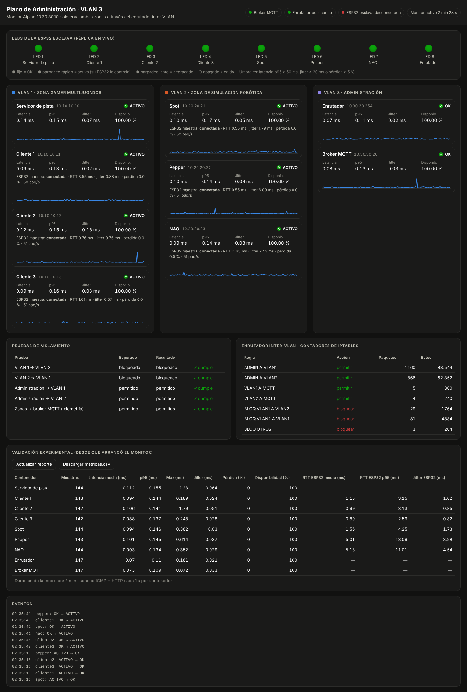
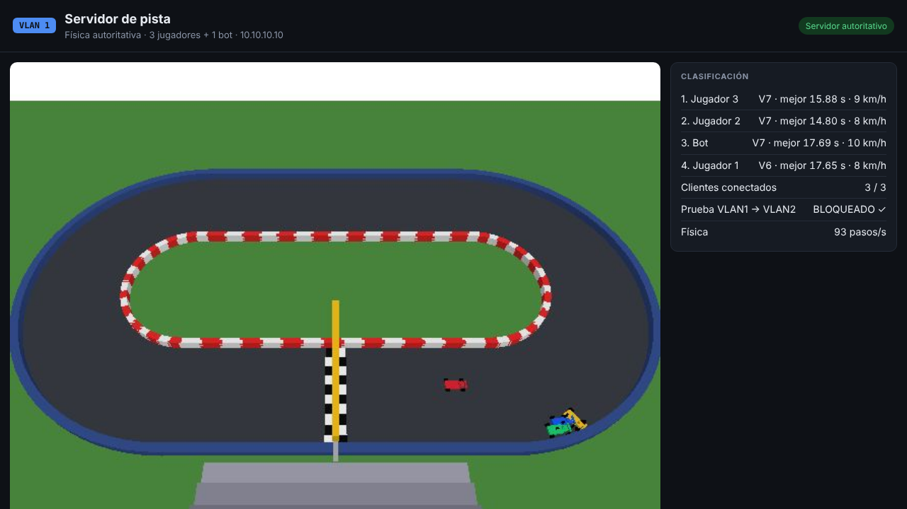
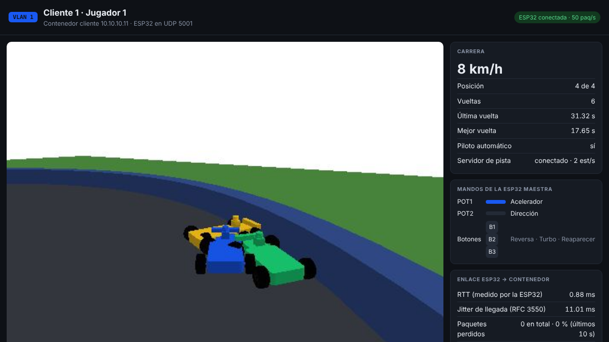
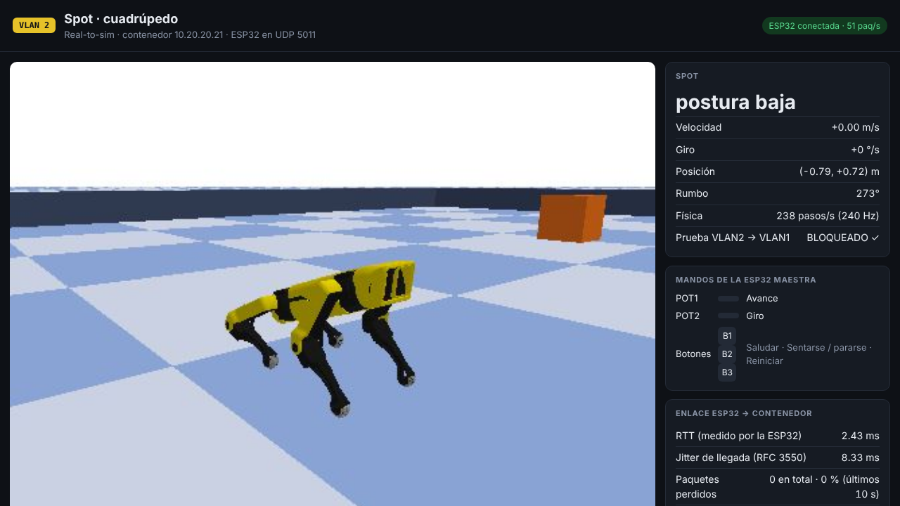
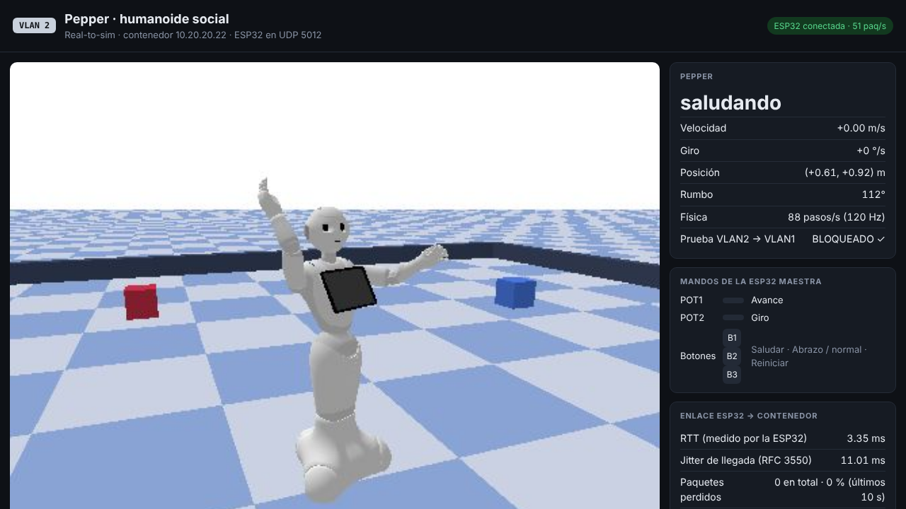
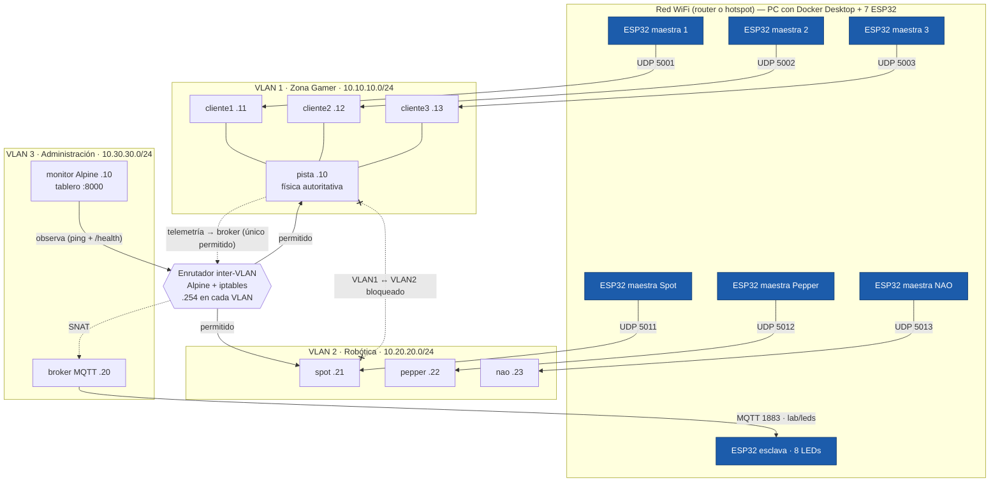

# Zonas Virtualizadas de Simulación Físico-Robótica controladas por ESP32 con Plano de Administración de Red

Laboratorio que integra **microcontroladores ESP32**, **simulación física con PyBullet**, **contenedores Docker**,
**segmentación por VLAN** y **monitoreo de red**, siguiendo un patrón **maestro-esclavo** entre las placas.

- **VLAN 1 · Zona Gamer Multijugador:** un servidor de pista en PyBullet y tres contenedores cliente; cada cliente lo maneja una ESP32 maestra.
- **VLAN 2 · Zona de Simulación Robótica:** tres contenedores independientes (**Spot, Pepper y NAO**); cada uno lo controla su propia ESP32 maestra (*real-to-sim*).
- **VLAN 3 · Plano de Administración:** un contenedor **Alpine** que mide **latencia, jitter y disponibilidad**, un **broker MQTT** de telemetría y una **ESP32 esclava** que muestra con LEDs el estado de cada contenedor.
- **Enrutador inter-VLAN:** permite que la administración observe ambas zonas **sin romper su aislamiento**.



| Pista (servidor) | Cliente 1 (cámara de su carro) |
|---|---|
|  |  |
| **Spot** | **Pepper** |
|  |  |

---

## Contenido

1. [Arquitectura](#1-arquitectura)
2. [Estructura del repositorio](#2-estructura-del-repositorio)
3. [Requisitos](#3-requisitos)
4. [Paso a paso: levantar el laboratorio](#4-paso-a-paso-levantar-el-laboratorio)
5. [Paso a paso: las ESP32 maestras](#5-paso-a-paso-las-esp32-maestras)
6. [Paso a paso: la ESP32 esclava de LEDs](#6-paso-a-paso-la-esp32-esclava-de-leds)
7. [Validación experimental](#7-validación-experimental-jitter-latencia-y-disponibilidad)
8. [Cómo funciona por dentro](#8-cómo-funciona-por-dentro)
9. [Docker Hub y GitHub](#9-docker-hub-y-github)
10. [Solución de problemas](#10-solución-de-problemas)
11. [Créditos y licencias](#11-créditos-y-licencias)

---

## 1. Arquitectura



### Direcciones y puertos

| Contenedor | VLAN | IP | Puerto ESP32 (UDP) | Página web |
|---|---|---|---|---|
| `zv-pista` | 1 | 10.10.10.10 | — | http://localhost:8080 |
| `zv-cliente1` / `2` / `3` | 1 | 10.10.10.11 / .12 / .13 | 5001 / 5002 / 5003 | http://localhost:8081 / 8082 / 8083 |
| `zv-spot` | 2 | 10.20.20.21 | 5011 | http://localhost:8091 |
| `zv-pepper` | 2 | 10.20.20.22 | 5012 | http://localhost:8092 |
| `zv-nao` | 2 | 10.20.20.23 | 5013 | http://localhost:8093 |
| `zv-monitor` (Alpine) | 3 | 10.30.30.10 | — | **http://localhost:8000** (tablero) |
| `zv-mqtt` (Mosquitto) | 3 | 10.30.30.20 | TCP 1883 (ESP32 esclava) | — |
| `zv-router` (Alpine) | 1, 2, 3 | .254 en cada una | — | — |
| `zv-guardia` | red del motor Docker | — | — | — |

### Política del enrutador inter-VLAN

| Origen → destino | Decisión | Para qué |
|---|---|---|
| VLAN 3 (administración) → VLAN 1 y VLAN 2 | **permitir** | el monitor observa (ping + HTTP `/health`) |
| VLAN 1 / VLAN 2 → broker `10.30.30.20:1883` | **permitir** (solo ese destino y puerto) | telemetría de las zonas |
| VLAN 1 ↔ VLAN 2 | **bloquear** | aislamiento entre zonas |
| zonas → cualquier otra cosa de la VLAN 3 | **bloquear** | proteger el plano de administración |
| respuestas de conexiones ya establecidas | permitir | que funcionen las anteriores |

Las VLAN son **redes Docker aisladas** (en Windows con Docker Desktop no hay etiquetado 802.1Q). El aislamiento se garantiza en dos capas:

1. Cada contenedor tiene sus rutas hacia las otras VLAN **apuntando al enrutador**. El enrutador decide con `iptables`, igual que un router con ACL entre VLAN.
2. La **guardia** (`zv-guardia`) impide que el motor de Docker encamine directamente entre los bridges de las VLAN. Así nadie puede saltarse el enrutador, ni siquiera un contenedor que cambie sus propias rutas. Este caso está incluido en las pruebas.

---

## 2. Estructura del repositorio

```
├── docker-compose.yml          3 VLAN, enrutador, guardia, 10 contenedores
├── .env.example                usuario de Docker Hub, licencia qibullet, umbrales
├── comun/                      código compartido por los contenedores de simulación
│   ├── enlace_esp32.py         UDP con la ESP32: ACK, pérdidas, jitter RFC 3550
│   ├── telemetria.py           publica a MQTT (a través del enrutador)
│   ├── visor_web.py            página de cada contenedor (/ /frame.jpg /estado.json /health)
│   ├── render_remoto.py        render de PyBullet en un proceso aparte
│   └── rutas.sh                instala las rutas hacia el enrutador inter-VLAN
├── vlan1_gamer/
│   ├── pista_comun.py          pista ovalada y carros (racecar de PyBullet)
│   ├── pista/                  servidor de pista (física autoritativa) + Dockerfile
│   └── cliente/                contenedor cliente (ESP32 → juego) + Dockerfile
├── vlan2_robotica/
│   ├── robot_sim.py            Spot / Pepper / NAO real-to-sim
│   ├── modelos/rex/            modelo tipo Spot (de rex-gym, Apache 2.0)
│   └── Dockerfile
├── vlan3_admin/
│   ├── monitor/                monitor Alpine + tablero web
│   ├── mqtt/mosquitto.conf     broker
│   ├── router/                 enrutador inter-VLAN (Alpine + iptables)
│   └── guardia/                2.ª capa de aislamiento (cadena DOCKER-USER)
├── firmware/
│   ├── esp32_maestra/          un sketch para las 6 maestras (se elige el ROL)
│   └── esp32_esclava_leds/     ESP32 esclava con 8 LEDs (MQTT)
├── herramientas/
│   ├── simulador_esp32.py      simula las 6 maestras (probar sin placas)
│   ├── validar_red.ps1 / .sh   15 pruebas de segmentación
│   ├── inyectar_falla.ps1 / .sh retardo, jitter, pérdida o caída de un contenedor
│   └── publicar_dockerhub.ps1 / .sh
└── docs/img/                   capturas
```

---

## 3. Requisitos

**Software**
- Windows 10/11 con **Docker Desktop** (backend WSL 2). También funciona en Linux y macOS.
- **Arduino IDE 2.x** con el core **esp32 by Espressif Systems** (2.x o 3.x).
- Librería **PubSubClient** (Nick O'Leary), solo para la ESP32 esclava.
- Python 3.8+ en el PC, solo si vas a usar el simulador de ESP32 (no necesita librerías extra).
- Unos 6 GB libres en disco y 8 GB de RAM; se recomienda una CPU de 4 núcleos o más.

**Hardware**
- **7 ESP32 DevKit V1**: 6 maestras y 1 esclava.
- Por cada maestra: **2 potenciómetros de 10 kΩ**, **3 pulsadores** y protoboard.
- Para la esclava: **8 LEDs** y **8 resistencias de 220–330 Ω**.
- Un router WiFi o el hotspot del celular, donde estén el PC y las 7 placas. Debe ser de 2,4 GHz.

---

## 4. Paso a paso: levantar el laboratorio

### 4.1 Configurar

```powershell
git clone https://github.com/<tu-usuario>/<este-repo>.git
cd <este-repo>
copy .env.example .env
notepad .env
```

En `.env`:
- `DOCKERHUB_USUARIO`: tu usuario de Docker Hub.
- `QIBULLET_ACEPTO_LICENCIA`: las mallas de **Pepper y NAO** son de SoftBank Robotics y vienen con qibullet bajo su propia licencia (EULA). Léela en el [repositorio de qibullet](https://github.com/softbankrobotics-research/qibullet). Si estás de acuerdo, pon `si`; si no, la imagen de robótica no se construye.

### 4.2 Construir y arrancar

```powershell
docker compose up -d --build
```

La primera vez tarda varios minutos, porque descarga PyBullet, qibullet y las imágenes base. Para comprobar que todo arrancó:

```powershell
docker compose ps
```

Deben aparecer **11 contenedores** `Up`: mqtt, router, guardia, monitor, pista, cliente1-3, spot, pepper y nao.

### 4.3 Validar la segmentación

```powershell
powershell -ExecutionPolicy Bypass -File herramientas\validar_red.ps1
```

Resultado esperado: **`15 correctas, 0 con falla`**. El script prueba desde dentro de los contenedores que:
- la administración llega a ambas zonas;
- VLAN 1 ↔ VLAN 2 está bloqueado en ambos sentidos;
- las zonas solo llegan al broker y no al monitor;
- un contenedor no puede saltarse el enrutador usando la puerta de enlace de Docker;
- dentro de cada zona la comunicación es normal.

### 4.4 Abrir las páginas

- **Tablero de administración:** http://localhost:8000
- **Pista:** http://localhost:8080 · **Clientes:** 8081, 8082, 8083
- **Spot / Pepper / NAO:** 8091, 8092, 8093

### 4.5 Probar sin las placas (opcional, recomendado antes de conectar el hardware)

```powershell
python herramientas\simulador_esp32.py
```

El simulador imita a las 6 maestras con el mismo protocolo del firmware y en la consola muestra el RTT de cada una:
- los carros dan vueltas con piloto automático;
- los robots caminan en círculo y cada ~12 s saludan o cambian de postura;
- en el tablero los 7 contenedores pasan a **ACTIVO**.

Para manejar uno a mano con el teclado (w/s, a/d, 1/2/3):

```powershell
python herramientas\simulador_esp32.py --modo manual --roles spot
```

### 4.6 Permitir el tráfico de las ESP32 en el Firewall de Windows

Las ESP32 llegan al PC por la WiFi, y Windows suele marcar esa red como **pública**. Abre PowerShell **como administrador** y ejecuta:

```powershell
New-NetFirewallRule -DisplayName "ZV ESP32 UDP" -Direction Inbound -Protocol UDP -LocalPort 5001-5013 -Action Allow
New-NetFirewallRule -DisplayName "ZV MQTT" -Direction Inbound -Protocol TCP -LocalPort 1883 -Action Allow
```

Para conocer la IP del PC (la necesitas en el firmware), ejecuta `ipconfig` y busca la **Dirección IPv4** del adaptador WiFi. Conviene fijarla, por ejemplo con una reserva DHCP en el router.

---

## 5. Paso a paso: las ESP32 maestras

### 5.1 Conexiones (iguales en las 6 maestras)

| Componente | Pin ESP32 | Conexión |
|---|---|---|
| Potenciómetro 1 | **GPIO 34** | extremos a 3V3 y GND, cursor al pin |
| Potenciómetro 2 | **GPIO 35** | extremos a 3V3 y GND, cursor al pin |
| Pulsador 1 | **GPIO 25** | entre el pin y GND (usa el pull-up interno) |
| Pulsador 2 | **GPIO 26** | entre el pin y GND |
| Pulsador 3 | **GPIO 27** | entre el pin y GND |
| LED de estado | GPIO 2 | el LED azul de la placa |

> Los potenciómetros van en pines del **ADC1** (32–39), porque el ADC2 no funciona mientras la WiFi está activa.

### 5.2 Qué hace cada mando

| ROL | Contenedor | POT1 | POT2 | B1 | B2 | B3 |
|---|---|---|---|---|---|---|
| 1, 2, 3 | cliente1/2/3 (carro) | acelerador | dirección | reversa (mantener) | turbo (mantener) | reaparecer en la parrilla |
| 4 | Spot | avanzar / retroceder | girar | dar la pata | sentarse / pararse | reiniciar |
| 5 | Pepper | avanzar / retroceder | girar | saludar | abrazo / normal | reiniciar |
| 6 | NAO | avanzar / retroceder | girar | saludar | agacharse / pararse | reiniciar |

En los robots, el **centro** del potenciómetro es "quieto"; hay una zona muerta del 6% para que no se muevan solos.

### 5.3 Cargar el firmware

1. Abre `firmware/esp32_maestra/esp32_maestra.ino`. Placa: **ESP32 Dev Module**.
2. En `config.h` edita:
   - `WIFI_SSID` y `WIFI_PASS`: la red donde está el PC.
   - `PC_IP`: la IP del PC con comas, por ejemplo `192, 168, 1, 50`.
   - `ROL`: de 1 a 6, uno distinto por placa.
3. Carga cada placa con su `ROL`. Etiquétalas para no confundirlas.
4. Monitor serie a **115200**. Cada segundo verás algo así:

```
[Spot] RTT prom 1.18 ms (min 0.61 / max 3.59) · jitter 0.90 ms · pérdida 0.0 % · estado OK · POT1  +758 POT2  +269 · B 000
```

**LED azul de la maestra**

| Patrón | Significado |
|---|---|
| fijo | el contenedor responde |
| parpadeo lento | hay WiFi pero el contenedor no responde (revisa IP, firewall, `docker compose ps`) |
| parpadeo rápido | sin WiFi |

---

## 6. Paso a paso: la ESP32 esclava de LEDs

### 6.1 Conexiones

| LED | Pin | Contenedor que representa |
|---|---|---|
| 1 | GPIO 4 | servidor de pista |
| 2 | GPIO 16 | cliente 1 |
| 3 | GPIO 17 | cliente 2 |
| 4 | GPIO 18 | cliente 3 |
| 5 | GPIO 19 | Spot |
| 6 | GPIO 21 | Pepper |
| 7 | GPIO 22 | NAO |
| 8 | GPIO 23 | enrutador inter-VLAN |

Cada LED va del pin a una resistencia de 220–330 Ω y de ahí a GND.

### 6.2 Cargar

1. En el Arduino IDE ve a **Herramientas → Administrar bibliotecas** e instala **PubSubClient** (Nick O'Leary).
2. Abre `firmware/esp32_esclava_leds/esp32_esclava_leds.ino`.
3. En `config.h` pon la WiFi y en `MQTT_HOST` la IP del PC.
4. Al encender hace un barrido de los 8 LEDs. Después se suscribe a `lab/leds`, y el tablero muestra **"ESP32 esclava · RSSI …"** en verde.

### 6.3 Qué significa cada LED

| Patrón | Estado | Cuándo |
|---|---|---|
| encendido fijo | **OK** | el contenedor responde y nadie lo está controlando |
| parpadeo rápido (4 Hz) | **ACTIVO** | su ESP32 maestra lo controla (en la pista: tiene clientes conectados) |
| parpadeo lento (1 Hz) | **DEGRADADO** | latencia p95 > 50 ms, jitter > 20 ms o pérdida > 5 %; los umbrales se ajustan en `.env` |
| apagado | **CAÍDO** | no responde ping ni `/health` durante 3 s |
| una luz que recorre la tira | sin datos | no hay conexión con el broker o el monitor no publica |

La esclava **no decide nada**, solo obedece: el maestro del plano de administración es el monitor, que publica los 8 dígitos (por ejemplo `22222221`) en `lab/leds`.

---

## 7. Validación experimental: jitter, latencia y disponibilidad

### 7.1 Qué se mide y cómo

| Métrica | Dónde se mide | Cómo |
|---|---|---|
| **Latencia de red** | monitor → cada contenedor, a través del enrutador | ICMP cada 1 s; media, p95 y máximo |
| **Jitter de red** | igual | variación entre RTT consecutivos, suavizado como en RFC 3550: `J = J + (\|D\| − J)/16` |
| **Disponibilidad** | monitor | % de sondeos en que respondieron el ping **y** el `/health` HTTP de la aplicación, contado desde la primera respuesta |
| **Pérdida** | monitor | % de pings sin respuesta |
| **RTT ESP32 ↔ contenedor** | la propia ESP32 | cada paquete recibe un ACK; RTT = llegada del ACK − envío (`micros()`) |
| **Jitter de llegada ESP32** | el contenedor | RFC 3550 sobre el tiempo de tránsito (marca `millis()` de la ESP32 vs. llegada) |
| **Pérdida ESP32** | el contenedor | huecos en el número de secuencia (ventana de 10 s) |

Todo queda en `datos/metricas.csv`, con una fila por contenedor y por segundo. El tablero tiene el botón **"Actualizar reporte"**, que muestra el resumen de la sesión (también en http://localhost:8000/api/reporte).

### 7.2 Protocolo sugerido

1. **Línea base (5 min):** todo funcionando, con las 6 ESP32 manejando. Guarda el reporte.
2. **Retardo y jitter:** `.\herramientas\inyectar_falla.ps1 nao 80 30` agrega 80 ms ± 30 ms al contenedor NAO.
   - En el tablero, NAO pasa a **DEGRADADO** y su LED 7 parpadea lento.
   - Para volver a la normalidad: `.\herramientas\inyectar_falla.ps1 nao quitar`.
3. **Pérdida:** `.\herramientas\inyectar_falla.ps1 cliente2 0 0 10` produce 10 % de pérdida en cliente2.
4. **Caída y recuperación:** `.\herramientas\inyectar_falla.ps1 pepper caer` apaga el LED 6 en unos 3 s. Luego `... pepper levantar`.
   - Fíjate cómo baja la disponibilidad acumulada y cuánto tarda en volver a OK.
5. **Aislamiento:** `validar_red.ps1` y la tabla "Pruebas de aislamiento" del tablero.
   - Compara los contadores `BLOQ_VLAN1_A_VLAN2` y `BLOQ_VLAN2_A_VLAN1`: suben cada 10 s por las pruebas automáticas que hacen la pista y Spot.
6. Descarga `metricas.csv` y grafica latencia, jitter y estado en el tiempo para cada experimento.

### 7.3 Resultados de referencia

Medición de 90 s con las 6 maestras simuladas. Fue en un equipo de pruebas de solo 2 núcleos, con los 11 contenedores en la misma máquina. Con ESP32 reales por WiFi, el RTT ESP32 suele estar entre 2 y 15 ms.

| Contenedor | Latencia media (ms) | p95 (ms) | Jitter (ms) | Pérdida | Disponibilidad | RTT ESP32 medio / p95 (ms) |
|---|---|---|---|---|---|---|
| pista | 0.095 | 0.157 | 0.034 | 0 % | 100 % | — |
| cliente1 | 0.094 | 0.151 | 0.026 | 0 % | 100 % | 0.89 / 2.14 |
| cliente2 | 0.094 | 0.136 | 0.030 | 0 % | 100 % | 0.90 / 2.39 |
| cliente3 | 0.085 | 0.133 | 0.027 | 0 % | 100 % | 0.88 / 2.59 |
| spot | 0.086 | 0.128 | 0.023 | 0 % | 100 % | 1.50 / 3.83 |
| pepper | 0.102 | 0.146 | 0.041 | 0 % | 100 % | 5.10 / 11.83 |
| nao | 0.090 | 0.121 | 0.030 | 0 % | 100 % | 4.92 / 10.78 |
| enrutador | 0.069 | 0.109 | 0.023 | 0 % | 100 % | — |
| broker MQTT | 0.065 | 0.106 | 0.021 | 0 % | 100 % | — |

Pepper y NAO tienen un RTT mayor porque sus modelos son los más pesados de simular, y en un equipo de 2 núcleos compiten por CPU.

---

## 8. Cómo funciona por dentro

### 8.1 Protocolo ESP32 ↔ contenedor (UDP, 50 Hz)

```
ESP32 → contenedor   C,<seq>,<millis>,<pot1>,<pot2>,<b1>,<b2>,<b3>,<rtt_us>,0
contenedor → ESP32   A,<seq>,<estado>
```

- `pot1` y `pot2` van normalizados de −1000 a 1000; los botones valen 1 si están presionados.
- La ESP32 incluye el último RTT que midió, así el contenedor lo reporta a la administración.
- El contenedor contesta el ACK **antes** de procesar el paquete, para que el RTT mida la red y no la simulación.
- El `estado` del ACK (por ejemplo `P2V3` = 2.º puesto, vuelta 3, o `SALUDO`) se ve en el monitor serie de la ESP32.
- **Seguridad:** si un contenedor deja de recibir paquetes durante 1 s, todos los mandos vuelven a cero y el carro o robot se detiene.

### 8.2 Zona gamer: cliente-servidor autoritativo

- **Servidor de pista:** es el único con física; corre a 240 Hz.
  - La pista es un óvalo de 11 m de recta y 4,5 m de radio, con muros con colisión.
  - Hay 3 carros de jugadores más un **bot** (el 4.º carro del diagrama). Usa el *racecar* de PyBullet, el mismo de los entornos `RacecarBulletEnv` usados con rl-baselines3-zoo.
  - Cuenta vueltas, mejor vuelta y posiciones. Un carro volcado o atascado reaparece solo.
- **Clientes:** cada uno traduce su ESP32 a comandos (`IN,...`, a 50 Hz por la VLAN 1), recibe el estado del servidor a 30 Hz y dibuja **su** carro con cámara de persecución. Es el mismo modelo que usan los juegos en red.

### 8.3 Zona robótica: real-to-sim

- La base de cada robot sigue la velocidad que pide la ESP32 mediante una restricción `JOINT_FIXED`. En Pepper la base se reubica directamente, como hace qibullet, porque en ese modelo su base tiene masa 0.
- Las articulaciones animan la marcha y los gestos con control de posición:
  - **Spot** trota con las patas diagonales en fase.
  - **NAO** alterna cadera, rodilla y tobillo.
  - **Pepper** acompaña con los brazos y gira la cabeza.
- Spot usa el modelo **Rex** de *rex-gym*. Pepper y NAO usan los modelos de **qibullet**, los mismos de *humanoid-gym*.

### 8.4 Render en un proceso aparte

El renderizador de PyBullet usa la CPU y tarda entre 70 y 250 ms por cuadro. Si dibujara en el mismo bucle que la física, la simulación iría en cámara lenta. Por eso:
- cada contenedor tiene un **proceso de render** con una copia espejo de la escena, en prioridad baja;
- el bucle de física le manda las poses solo mientras alguien mira la página.

### 8.5 Plano de administración

- **Monitor:** sondea cada segundo los 9 objetivos a través del enrutador. Recibe por MQTT la telemetría de las zonas (`lab/telemetria/*`) y los contadores del enrutador (`lab/router`). Calcula el estado de cada contenedor y publica:
  - `lab/leds`: retenido, lo consume la esclava;
  - `lab/estado/<nombre>`: retenido.
- **Enrutador:** publica cada 2 s los contadores de cada regla de `iptables`.
- **Guardia:** mantiene las reglas `DROP` entre `br-vlan1`, `br-vlan2` y `br-vlan3` en la cadena `DOCKER-USER`.

### 8.6 Dos detalles de Docker que se resolvieron

- **Docker Engine 28+** (el de Docker Desktop actual) trae una "protección de acceso directo" que descarta los paquetes que reenvía un contenedor enrutador. En el `docker-compose.yml` las 3 redes usan `gateway_mode_ipv4: nat-unprotected` para desactivarla, y la guardia compensa esa protección con reglas más precisas.
- El broker MQTT no tiene ruta de regreso hacia las zonas. Por eso el enrutador hace **SNAT** a la telemetría que va al broker, y así la respuesta vuelve por el enrutador y no por el host.

---

## 9. Docker Hub y GitHub

**Subir las imágenes** (con `DOCKERHUB_USUARIO` y `QIBULLET_ACEPTO_LICENCIA=si` en `.env`):

```powershell
powershell -ExecutionPolicy Bypass -File herramientas\publicar_dockerhub.ps1
```

Se publican `zv-router`, `zv-guardia`, `zv-monitor`, `zv-pista`, `zv-cliente` y `zv-robot`. El broker usa la imagen oficial `eclipse-mosquitto:2`.

**Usar las imágenes publicadas sin construir:**

```powershell
docker compose pull
docker compose up -d --no-build
```

**Subir el código a GitHub:**

```powershell
git init
git add .
git commit -m "Zonas virtualizadas ESP32 + PyBullet + VLAN"
git branch -M main
git remote add origin https://github.com/<tu-usuario>/<repo>.git
git push -u origin main
```

> Ten en cuenta que la imagen `zv-robot` incluye las mallas de Pepper y NAO de SoftBank. Revisa su licencia antes de publicarla como pública en Docker Hub; si tienes dudas, déjala **privada**.

---

## 10. Solución de problemas

| Síntoma | Causa probable y solución |
|---|---|
| La imagen de robótica no construye: "debes aceptar la licencia…" | Pon `QIBULLET_ACEPTO_LICENCIA=si` en `.env` (después de leerla). |
| La LED de la maestra parpadea lento | El PC no recibe UDP: revisa `PC_IP`, las reglas del firewall (4.6), que el PC y la ESP32 estén en la misma red, y `docker compose ps`. |
| El tablero marca las zonas **CAÍDO** pero los contenedores están `Up` | Mira `docker logs zv-router` y `docker logs zv-guardia`. El router debe mostrar `ip_forward=1` y las 8 reglas. |
| `validar_red` falla en "monitor → pista" | Revisa que las redes tengan `gateway_mode_ipv4: nat-unprotected`: `docker network inspect vlan1_gamer`. |
| La esclava muestra una luz que recorre la tira | No llega al broker: revisa `MQTT_HOST` y la regla TCP 1883 del firewall. |
| Movimientos en cámara lenta y "Física" muy por debajo de 240 Hz (120 Hz en Pepper y NAO) | El PC no da abasto. Cierra las pestañas de las páginas que no estés mirando (solo renderizan con alguien mirando) o asígnale más CPU a Docker Desktop (*Settings → Resources*). |
| `inyectar_falla` dice que no puede aplicar netem | El kernel donde corre Docker no trae el módulo `sch_netem`. Actualiza WSL (`wsl --update`) y Docker Desktop. Si aun así no está, usa los experimentos `caer` / `levantar`, que no lo necesitan. |
| Los carros no se mueven con la ESP32 | En la página del cliente mira la barra POT1: si va al revés, pon `INVERTIR_POT1 1` en `config.h`. |

---

## 11. Créditos y licencias

- **PyBullet** (zlib) y su modelo *racecar*, el mismo que usan los entornos Racecar de [rl-baselines3-zoo](https://github.com/DLR-RM/rl-baselines3-zoo).
- **Rex**, cuadrúpedo tipo Spot, de [rex-gym](https://github.com/nicrusso7/rex-gym), bajo licencia Apache 2.0. Ver `vlan2_robotica/modelos/rex/LICENSE`.
- **Pepper y NAO**: modelos de [qibullet](https://github.com/softbankrobotics-research/qibullet), los mismos que usa [humanoid-gym](https://github.com/0aqz0/humanoid-gym). Las mallas son de SoftBank Robotics y tienen su propia EULA, que se acepta explícitamente en `.env`.
- Eclipse Mosquitto (EPL/EDL), Alpine Linux y PubSubClient (MIT).

Proyecto académico, UMNG, Ingeniería Mecatrónica.
